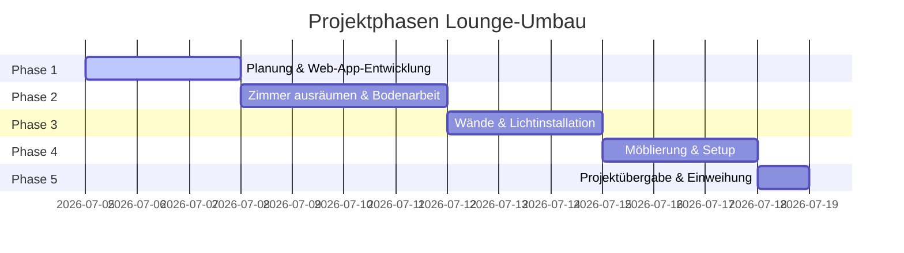

# Project Roadmap - PROJECT ELIAH LOUNGE

Dieses Dokument beschreibt den zeitlichen Ablauf und die Phasen für die Umgestaltung des Zimmers in eine moderne Lounge.

## Vision
Ein modern gestaltetes Zimmer zum Entspannen, Fernsehen und Treffen mit Freunden, realisiert durch Eliah als Projektleiter und Papa als Investor/Unterstützer.

## Phasen des Projekts

### Phase 1: Planung & Digitales Setup
* **Ziel:** Fertigstellung der digitalen Projektfreigabe-App (diese Web-App).
* **Meilensteine:**
  * Freigabe des Investitionspakets durch Sponsor (Unterschrift).
  * Festlegung des endgültigen Designs und der Prioritäten.

### Phase 2: Vorbereitung & Bodenarbeit
* **Ziel:** Baufreiheit schaffen und den Holzfußboden restaurieren.
* **Aktivitäten:**
  * Zimmer komplett leerräumen.
  * Parkettboden fachgerecht abschleifen (Leihgerät).
  * Parkettboden grundreinigen und ölen (Trocknungszeit beachten).

### Phase 3: Wände & Lichtkonzept
* **Ziel:** Farbliche Gestaltung und stimmungsvolle Beleuchtung.
* **Aktivitäten:**
  * Wände und ggf. Decke streichen (Farbtonabstimmung passend zur Couch).
  * Installation der indirekten LED-Beleuchtung (Smart Home / App-gesteuert).

### Phase 4: Einrichtung & Media-Setup
* **Ziel:** Integration der Möbel und technischen Geräte.
* **Aktivitäten:**
  * Couch aus dem Wohnzimmer ins Zimmer transportieren und ausrichten.
  * TV- & Soundsystem installieren.
  * *Optional:* Setup des Getränkekühlschranks.
  * *Optional:* Dezente Gaming-Ecke integrieren.

### Phase 5: Lounge-Opening
* **Ziel:** Gemeinsamer Aufbau und feierliche Übergabe.
* **Aktivitäten:**
  * Dekoration und letzter Feinschliff.
  * Einweihungs-Chill-Session (Projektleiter und Sponsor).
